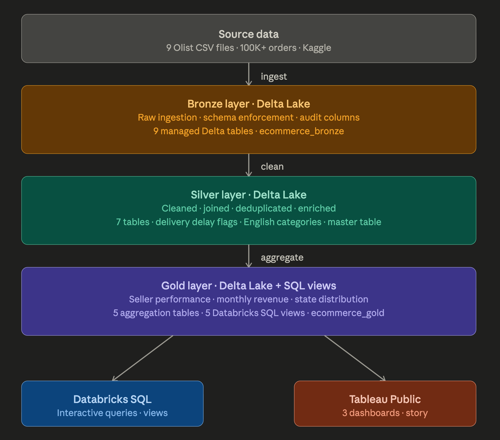
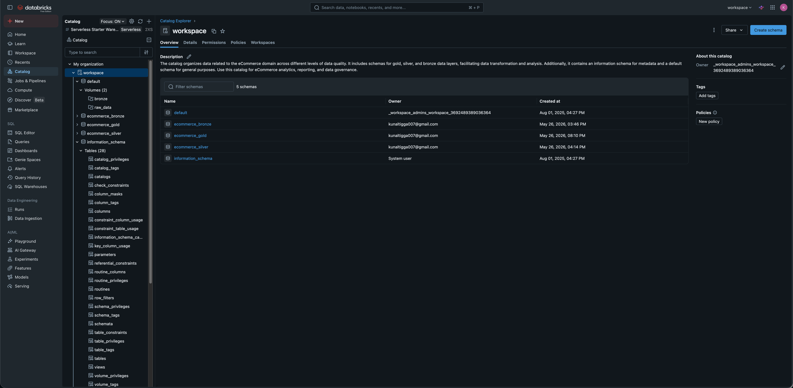
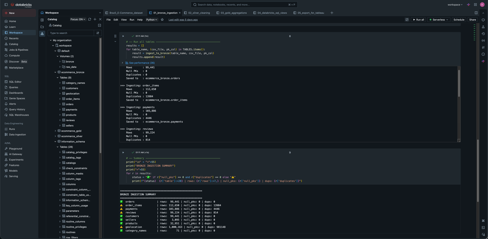
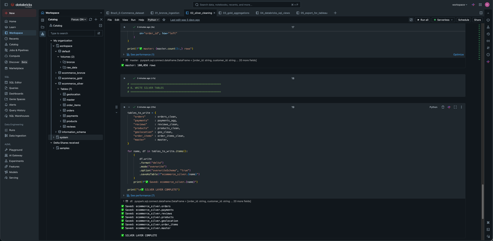
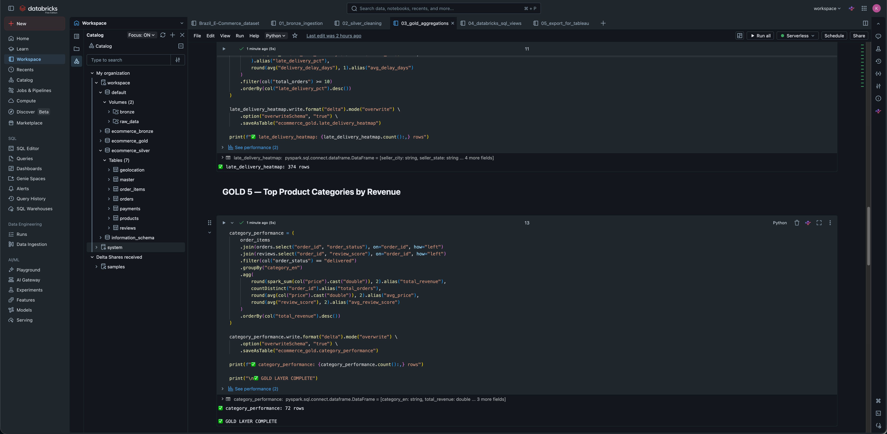

# 🛒 Brazilian E-Commerce Analytics Pipeline

An end-to-end data engineering project built on **Databricks** and **PySpark**, implementing a **Medallion Architecture** (Bronze → Silver → Gold) on real-world e-commerce data from Olist (Brazil).

The pipeline ingests 9 relational CSV tables (100K+ orders) into **Delta Lake**, applies multi-stage cleaning and enrichment using PySpark transformations, and produces business-ready aggregations exposed via **Databricks SQL views**. Analytics are delivered through an interactive **Tableau Public** story covering revenue trends, seller performance, and delivery risk across Brazil.

This project demonstrates production-grade data engineering practices including:
- Schema enforcement and data quality checks at ingestion
- Timestamp parsing, null handling, and deduplication in the transformation layer
- Window functions, derived metrics, and business logic in the aggregation layer
- Separation of raw, cleaned, and serving layers using the Medallion pattern
- End-to-end traceability from raw CSV to dashboard

---

## 📊 Live Dashboard

🔗 [View on Tableau Public](https://public.tableau.com/views/BrazilianE-CommerceAnalytics/E-CommerceAnalyticsStory)

---

## 🏗️ Architecture



---

## 🖼️ Pipeline Screenshots

**Medallion Layer Tables in Databricks Catalog**


**Bronze Ingestion Summary**


**Silver Layer Complete**


**Gold Layer Complete**


---

## 📁 Project Structure

```
ecommerce-pyspark-databricks/
│
├── 01_bronze_ingestion.py
│   └── Reads 9 raw CSVs from Unity Catalog Volume
│   └── Adds audit columns (_ingested_at, _source_file)
│   └── Runs null PK and duplicate checks
│   └── Writes managed Delta tables to ecommerce_bronze
│
├── 02_silver_cleaning.py
│   └── Parses timestamps, derives delivery_delay_days
│   └── Flags late deliveries (is_late_delivery)
│   └── Deduplicates reviews (latest per order)
│   └── Aggregates payments to one row per order
│   └── Joins products with English category names
│   └── Averages geolocation per zip code
│   └── Writes 7 cleaned tables to ecommerce_silver
│
├── 03_gold_aggregations.py
│   └── seller_performance — revenue, review score, late delivery % per seller
│   └── monthly_revenue — revenue trend by category and month
│   └── state_distribution — customer count and revenue by state
│   └── late_delivery_heatmap — late delivery % by seller city
│   └── category_performance — revenue and review score by category
│
├── 04_databricks_sql_views.py
│   └── vw_seller_performance — adds seller tier classification
│   └── vw_monthly_revenue_trend — adds cumulative revenue window function
│   └── vw_state_distribution — adds revenue share % per state
│   └── vw_late_delivery_heatmap — adds delivery risk level classification
│   └── vw_category_performance — adds revenue rank and share per category
│
├── 05_export_for_tableau.py
│   └── Exports all 5 Gold views as single CSV files
│   └── Saves to Unity Catalog Volume for download
│
└── screenshots/
    ├── architecture.png
    ├── catalog_tables.png
    ├── bronze_summary.png
    ├── silver_complete.png
    └── gold_complete.png
```
---

## 🔧 Tech Stack

| Layer | Tool |
|---|---|
| Processing | PySpark (Databricks) |
| Storage | Delta Lake (Unity Catalog Volumes) |
| Orchestration | Databricks Notebooks |
| SQL Layer | Databricks SQL Views |
| Visualization | Tableau Public |
| Source Data | Kaggle — Olist Brazilian E-Commerce |

---

## 📦 Dataset

- **Source:** [Olist Brazilian E-Commerce — Kaggle](https://www.kaggle.com/datasets/olistbr/brazilian-ecommerce)
- **Size:** 100K+ orders, 9 relational tables
- **Period:** 2016 – 2018

**Tables ingested:**
- `orders`, `order_items`, `payments`, `reviews`
- `customers`, `sellers`, `products`
- `geolocation`, `category_name_translation`

---

## 🥉 Bronze Layer

- Ingested all 9 CSVs into Delta tables
- Added audit columns: `_ingested_at`, `_source_file`
- Ran data quality checks: null PKs, duplicate counts
- Registered tables in `ecommerce_bronze` database

---

## 🥈 Silver Layer

- Parsed and standardized all timestamps
- Derived `delivery_delay_days` and `is_late_delivery` flags
- Deduplicated reviews (kept latest per order)
- Aggregated payments to one row per order
- Joined products with English category names
- Averaged geolocation per zip code
- Built a master joined table across all entities

---

## 🥇 Gold Layer

5 aggregation tables built for analytics:

| Table | Description |
|---|---|
| `seller_performance` | Revenue, avg review, late delivery % per seller |
| `monthly_revenue` | Revenue trend by category and month |
| `state_distribution` | Customer count and revenue by Brazilian state |
| `late_delivery_heatmap` | Late delivery % by seller city |
| `category_performance` | Revenue and review score by product category |

---

## 📈 Databricks SQL Views

5 views built on Gold tables with additional business logic:

- `vw_seller_performance` — Seller tier classification (Top / Average / Underperformer)
- `vw_monthly_revenue_trend` — Cumulative revenue window function
- `vw_state_distribution` — Revenue share % per state
- `vw_late_delivery_heatmap` — Delivery risk level classification
- `vw_category_performance` — Revenue rank and share per category

---

## 📊 Dashboards (Tableau Public)

**Dashboard 1 — Revenue Overview**
- Monthly revenue trend by top 10 categories
- Top 10 categories by total revenue with avg review score

**Dashboard 2 — Seller Performance**
- Seller count by tier (Top / Average / Underperformer)
- Revenue vs review score scatter plot per seller

**Dashboard 3 — Delivery & Geography**
- Customer revenue choropleth map by Brazilian state
- Late delivery risk by seller city (top 20)

---

## 💡 Key Insights

- **Health & Beauty** is the highest revenue category at $1.23M
- **São Paulo** accounts for ~37% of total platform revenue
- Only **18.6%** of sellers qualify as Top Sellers
- **Tres de Maio** has the highest late delivery rate among cities

---

## ▶️ How to Run

1. Download dataset from Kaggle and upload CSVs to a Databricks Volume
2. Run notebooks in order: `01` → `02` → `03` → `04` → `05`
3. Each notebook builds on the previous layer
4. Query Gold tables via Databricks SQL or export CSVs for Tableau
